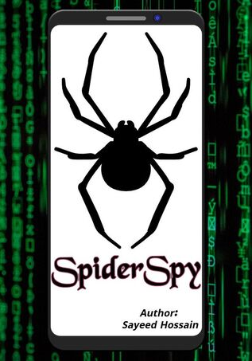

<!-- PROJECT LOGO -->
 

  

  <h3 align="center">SpiderSpy (Powerful Phone Monitoring Spy App)</h3>

  

    SpiderSpy - Powerful Phone Monitoring App For Parents, Employers, Military Forces and Intelligence Agencies.
  

<!-- TABLE OF CONTENTS -->

  
Table of Contents

  <ol>
    <li>
      <a href="#about-the-project">About The Project</a>
      <ul>
        <li><a href="#built-with">Built With</a></li>
      </ul>
    </li>
    <li>
      <a href="#getting-started">Getting Started</a>
      <ul>
        <li><a href="#prerequisites">Prerequisites</a></li>
        <li><a href="#installation">Installation</a></li>
      </ul>
    </li>
    <li><a href="#usage">Usage</a></li>
   
  </ol>

<!-- ABOUT THE PROJECT -->
## About The Project

 

SpiderSpy Monitoring is the next generation of smartphone surveillance software. This mobile Monitoring/tracker application records the incoming and outgoing phone calls, Whatsapp calls, sms and surroundings with tracks gps locations, the browser activity and messages from applications like Whatsapp, Facebook, Viber, Skype, Line etc. Also it has more features like hidden app icon (stealth mode), take pictures, advance and powerful keylogger, phishing social network,get every click etc. And the most important thing is that you can use this app for Multiple Child clients.

This application can be used for:

* Tracking your children. You can monitor your children in order to keep them out of harm’s way.
* Tracking your employees. You can monitor your employees in order to see if they use their phone or their time for other reasons.
* Backup – backing up data from your phone.
* Tracking your phone if it was stolen or if you have lost your phone.
* Also this app can be most useful for Military Forces and Intelligence Agencies.

Some of the best features Of Our App!

* Multiple Child clients
* Monitor All Social Media
* Advance and Powerful Keylogger
* Hidden App Icon (Stealth Mode)
* Record Phone Calls
* Track Device Locations
* Monitor Installed Applications
* Listen To Environment
* Take Pictures
* View All Notification
* Phishing Social Network
* Get Every Click Details
* Get All Message
* More…

For more details, Check out the website: <a href="https://spiderspy.giveturn.com/"> Click Here </a>

(<a href="#top">back to top</a>)

### Built With

* [Android Studio](https://developer.android.com/studio)
* [Kotlin](https://kotlinlang.org/)
* [Firebase](https://firebase.google.com/)
* More...

(<a href="#top">back to top</a>)

<!-- GETTING STARTED -->
## Getting Started
### Prerequisites
### Installation
All of those sections are Private. Because ↓  
## Read Carefully !!!
SpiderSpy is a Powerful Phone Monitoring App For Parents, Employers, Military Forces and Intelligence Agencies. You know this is a spy app and that's why you have to follow and agree with our privacy policy and terms & conditions. But don't worry, all the procedures are pretty simple. We will give you step by step instructions and guide you how you can use and set up this Powerful Phone Monitoring App easily.
If you are interested then Just mail at contact@spiderspy.giveturn.com to get this Powerful Phone Monitoring App.

(<a href="#top">back to top</a>)

<!-- USAGE EXAMPLES -->
## Usage

This application can be used for:

* Tracking your children. You can monitor your children in order to keep them out of harm’s way.
* Tracking your employees. You can monitor your employees in order to see if they use their phone or their time for other reasons.
* Backup – backing up data from your phone.
* Tracking your phone if it was stolen or if you have lost your phone.
* Also this app can be most useful for Military Forces and Intelligence Agencies.

(<a href="#top">back to top</a>)

